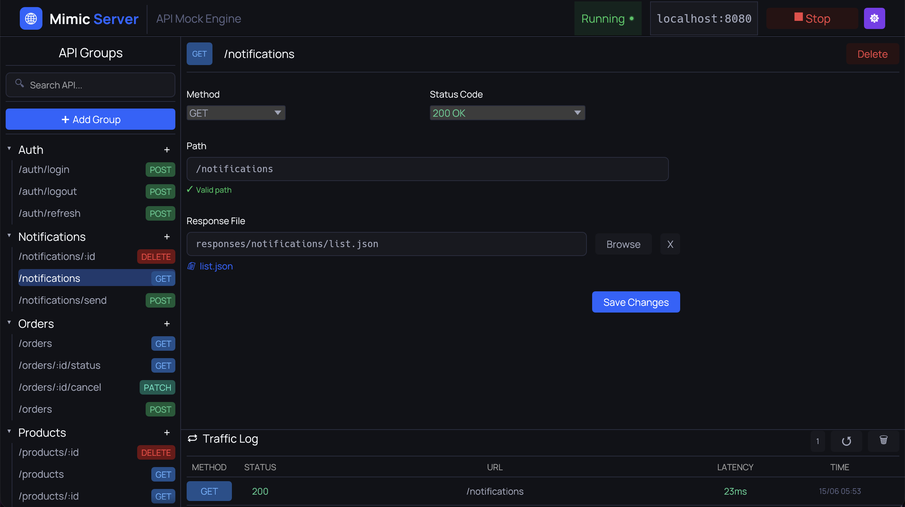
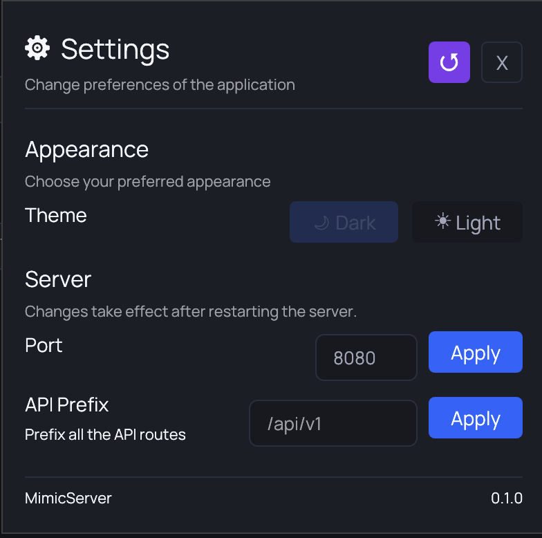

#  MimicServer | v1.0

> A [PhoticLabs](https://github.com/Photic-Labs/) product.

**MimicServer** is a local-first API mocking engine and gateway for developers.
Define mock routes (organized into groups), serve JSON responses instantly with
path-parameter support (`/api/user/:id`), and inspect live traffic —
all from a fast, native desktop app with zero cloud dependency.



---

## Why MimicServer

| Problem | MimicServer's Answer |
|---|---|
| Mock platforms require internet | Runs 100% locally — no account, no cloud |
| Electron apps are heavy and slow | Native Rust binary — `< 15MB`, instant startup |
| JSON config files break silently | SQLite — relational, transactional, crash-safe |
| Server restarts drop in-flight requests | Hot reload via `Arc<RwLock<>>` — zero downtime |
| Traffic is invisible during development | Built-in traffic log — every request recorded |

---

## Features

- **Mock any HTTP endpoint** — define method, path, status code, and a `.json` response file
- **Path-parameter support** — use `:id` segments in paths (`/api/user/:id`)
- **Organize routes in groups** — logical folders for your API endpoints
- **Instant hot reload** — save a route and it is live immediately, no server restart
- **Traffic log** — see every request: method, status, URL, latency, timestamp
- **Port & prefix configuration** — run on any port and/or behind a global prefix via the settings panel
- **Light/Dark theme** — toggle between themes in settings
- **Health endpoint** — `GET /health` always available to confirm the server is alive
- **Cross-platform** — single binary for Windows, macOS, and Linux
- **Branded UI** — dark, professional developer-tool aesthetic built on the PhoticLabs design system

---


## Tech Stack

| Layer | Choice |
|---|---|
| UI | `egui` + `eframe` |
| Design System | `pl-components` (PhotoicLabs internal crate) |
| Async Runtime | Tokio |
| HTTP | Axum + Hyper |
| Database | SQLite via `rusqlite` (WAL mode, foreign keys) |
| Payload Storage | Raw `.json` files on disk |

---

## Out of Scope (by design)

- No request header inspection — ignored
- No response templating — static `.json` files only
- No authentication on the mock server
- No cloud sync — local-first, always


---

## Getting Started

### Prerequisites

- [Rust](https://rustup.rs/) 1.75 or later
- Cargo (included with Rust)

### Build and Run

```bash
# Clone the repository
git clone https://github.com/Photic-Labs/mimic-server.git
cd mimic-server

# Run in development mode
cargo run

# Build release binary
cargo build --release
```

The app opens a native window.  
The database is created automatically on first run in your platform's data directory:

- **macOS:** `~/Library/Application Support/MimicServer/mimic_server_v1.db`
- **Linux:** `~/.local/share/MimicServer/mimic_server_v1.db`
- **Windows:** `C:\Users\<USER>\AppData\Roaming\MimicServer\mimic_server_v1.db`

### First Use

1. Open the app
2. Click **▶ Start Server** in the top bar
3. The server binds to `localhost:8080` by default
4. Add an API group in the sidebar, then add routes inside it
5. Select a route to edit — set method, path (supports `:id` params), status code, and a `.json` file
6. Hit the endpoint from your app or `curl`
7. Watch the request appear in the Traffic Log panel

```bash
# Confirm the server is alive
curl http://localhost:8080/health

# Hit a configured mock route
curl http://localhost:8080/api/your-route
```

---

## Configuration

Port and API prefix are stored in the `app_config` SQLite table.
Default port: `8080`. Default prefix: empty.
Change them in the Settings panel — takes effect on next server start.

The global prefix applies to all routes. For example, with prefix `/api/v1`,
a route at `/users` is served at `/api/v1/users`.



---

## Response Files

Each route points to a `.json` file on disk.  
The file is read fresh on every request — edit it externally and the next request picks up the change immediately.

```json
{
  "id": 1,
  "name": "John Doe",
  "email": "johndoe@annonymus.com"
}
```

If the file is missing or contains invalid JSON, MimicServer responds `500` with a descriptive error body instead of crashing.

---

## HTTP Response Headers

Every matched route returns these headers:

```
Content-Type:         application/json
X-Mimic-Route-Id:    <route_id>
X-Mimic-Latency-Ms:  <latency>
X-Powered-By:        MimicServer
```

---

## Error Responses

| Scenario | Status | Error Code |
|---|---|---|
| Route matched, `.json` file missing | `500` | `response_file_not_found` |
| Route matched, file is invalid JSON | `500` | `invalid_json_file` |
| Route matched, no file configured | `501` | `no_response_file_configured` |
| No matching route (not even pattern) | `404` | `route_not_found` |


---

## Installation & Setup

Download the latest version for your operating system from the [Releases Page](https://github.com/Photic-Labs/mimic-server/releases).

### 🍏 macOS Installation Note (Gatekeeper)
Because MimicServer is an independent open-source project built entirely locally, the binaries are currently self-signed. On modern macOS (Apple Silicon/Intel), Gatekeeper will block the application on first launch with a "Move to trash" or "Unidentified developer" warning.

To bypass this and run the app natively:
1. Drag **Mimic Server.app** into your `/Applications` folder.
2. Open your terminal and run the following command to clear the macOS quarantine flag:
   ```bash
   xattr -cr "/Applications/Mimic Server.app"
   ```


---

## License

GNU General Public License v3.0 © [PhoticLabs](https://github.com/Photic-Labs)

See [LICENSE](LICENSE) for the full text.
